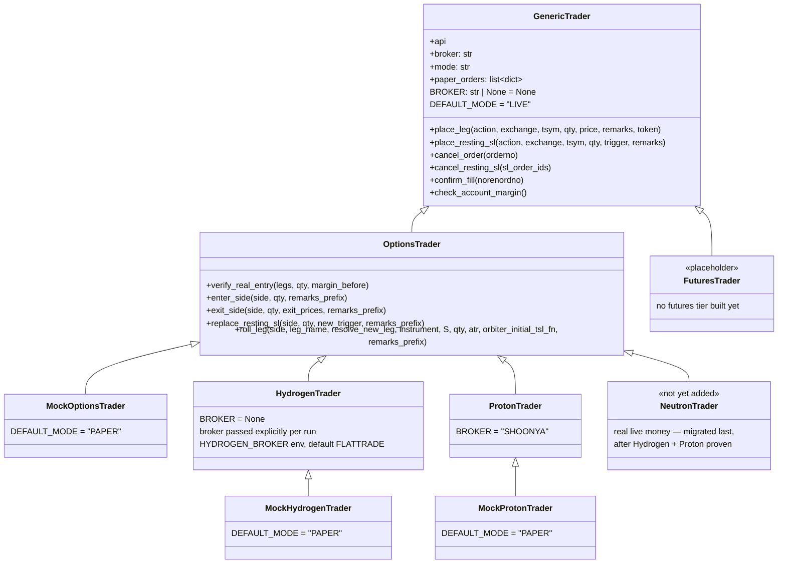

# Elements OOP Architecture

`antariksh/elements.py` — shared live-order execution code for the ORBITER v3.0
overnight/EOD tiers (NEUTRON+, HYDROGEN+, PROTON+). Built 2026-08-07, replacing an
earlier flat-function version of the same file after user direction to go OOP
before more tiers/instrument types (futures) arrive.

## Why this exists

Each tier used to keep its own copy-pasted entry/exit/SL-replace/roll logic. A bug
fix in one (e.g. NEUTRON+'s Aug6/7 stranded-leg and SL-replace-race fixes) never
reached the others without a second manual pass. One class hierarchy, all tiers
inherit from it.

## Class hierarchy



## Testing: mode injection + PAPER call recording

`mode` ("LIVE"/"PAPER") is a constructor arg on `GenericTrader`, not hardcoded —
subclasses set `DEFAULT_MODE` and a caller can still override it explicitly.
In PAPER mode every order-placing primitive (`place_leg`, `place_resting_sl`,
`cancel_order`, `cancel_resting_sl`) short-circuits to a canned successful
result **without touching `self.api`** — so `api=None` works — and appends
the call's exact parameters to `self.paper_orders`. That list is the
assertion surface for tests: correct action/exchange/tsym/qty/price/trigger
reached the placement call, and in the right order (hedge before short on
entry, short before hedge on exit, cancel before replace on SL-replace).

**Deliberately out of scope**: whether the broker actually accepts/fills the
order, WS behavior, rejection handling — that's the broker's own
responsibility, already covered by the separate Shoonya/Flattrade test
suites. This hierarchy's tests stop at "did we send the right order," not
"did the order execute."

`MockOptionsTrader`, `MockHydrogenTrader`, `MockProtonTrader` are thin
subclasses that just set `DEFAULT_MODE = "PAPER"` — self-documenting test
fixtures. Functionally identical to constructing the real tier class with
`mode="PAPER"` explicitly; the Mock names exist for readability at call
sites in tests, not because they behave differently.

```python
from elements import MockProtonTrader

t = MockProtonTrader(api=None)
t.enter_side(side, qty, "TEST_PROTON")
assert t.paper_orders[0]["call"] == "place_leg"
assert t.paper_orders[0]["action"] == "B"   # hedge BUY first
assert t.paper_orders[1]["action"] == "S"   # short SELL second
assert t.paper_orders[2]["trigger"] == side["dynamic_sl"]
```

## What's live vs planned

| Class | Status | Notes |
|---|---|---|
| `GenericTrader` | Built | Broker-agnostic order primitives only — no spread-shape assumptions. |
| `OptionsTrader` | Built | 2-leg (short+hedge) spread execution. All current tiers are options tiers. |
| `FuturesTrader` | Stub only | Sibling of `OptionsTrader`, empty — no futures tier exists to justify building it out yet. |
| `HydrogenTrader` | Built + wired | `hydrogen_ic_pilot_orbiter.py`'s wrapper functions call this class. |
| `ProtonTrader` | Built + wired | `proton_live.py`'s wrapper functions call this class. |
| `MockOptionsTrader` / `MockHydrogenTrader` / `MockProtonTrader` | Built | `DEFAULT_MODE = "PAPER"` test fixtures — see Testing section below. |
| `NeutronTrader` | Not started | `monthly_ic_pilot_orbiter.py` stays on its own already-fixed local copies until Hydrogen + Proton prove the hierarchy solid. Real live money — deliberately last. |

## Method reuse across tiers

Every method below is defined **once**, in `OptionsTrader` (or `GenericTrader` for the
lower-level primitives), and reused unchanged by every tier's leaf class. A tier only
differs by `broker` (and, once `NeutronTrader` exists, whatever instrument/expiry
params live outside this file in each tier's own module — this file only owns
order execution, not signal/entry-timing logic).

| Method | Owner class | Used by |
|---|---|---|
| `place_leg`, `place_resting_sl`, `cancel_order`, `cancel_resting_sl`, `confirm_fill`, `check_account_margin` | `GenericTrader` | Hydrogen, Proton, (Neutron later) |
| `verify_real_entry` | `OptionsTrader` | Hydrogen, Proton, (Neutron later) |
| `enter_side` | `OptionsTrader` | Hydrogen, Proton, (Neutron later) |
| `exit_side` | `OptionsTrader` | Hydrogen, Proton, (Neutron later) |
| `replace_resting_sl` | `OptionsTrader` | Hydrogen, Proton, (Neutron later) |
| `roll_leg` | `OptionsTrader` | Not yet called by any tier — kept ready for when Neutron migrates (Neutron is the only tier that currently rolls legs). |

## Design decisions worth remembering

- **Instances are cheap, never persisted.** Each tier is a one-shot cron script;
  state lives in JSON on disk, not in a long-lived object. A `Trader` instance is
  built fresh per call (or per tick), not held across ticks.
- **Broker as constructor arg, not global.** `ProtonTrader.BROKER = "SHOONYA"` is a
  static default because Proton hardcodes Shoonya everywhere. `HydrogenTrader` has
  no static default — its broker is env-selected per run (`HYDROGEN_BROKER`,
  default `FLATTRADE`) and passed in explicitly at construction.
- **`FuturesTrader` is a placeholder, not a real implementation.** Built only to
  establish the sibling slot next to `OptionsTrader` — no methods, because there's
  no futures tier yet to derive real requirements from. Fleshing it out before a
  futures tier exists would be guessing at an interface with no real caller to
  validate it against.
- **Instrument/exchange/timeframe overrides live outside this file, for now.**
  Each tier's own module (`hydrogen_ic_pilot_orbiter.py`, `proton_live.py`)
  already owns instrument selection and expiry-cadence logic. This hierarchy only
  covers order *execution*. Pulling instrument/timeframe config into the class
  hierarchy itself is a plausible next step but not done yet — no second
  instrument type exists to prove the abstraction against.

## Migration order

Hydrogen → Proton → Neutron, same order as the earlier flat-function migration.
Neutron is real live money and stays on its own code until the other two are
verified live-cron-safe on the new class hierarchy.
